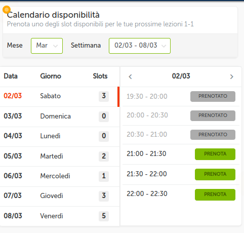

# GO + htmx • Reservations

This project was born from an idea and the desire to set up a project __one step at a time__ starting from the basics.

start from this README :-) 

Use case:
imagine a pro: a barber, a teacher, a consultant who offers his time;
the idea is to give him the opportunity to create a calendar of the week in which he gives his customers 
the opportunity to see when he has free time and book a slot of time.

A wizard similar to the one used for creating online surveys.

Inspire by [Matteo Vaccari TODO project](https://github.com/xpmatteo/todomvc-golang) in which he 
create a [Single Page Application](https://it.wikipedia.org/wiki/Single-page_application) without javascript but 
using only the attributes of [htmx](https://htmx.org).  The body of the page is replaced at every request, with no full page reloads.

Next a UI proposal (screenshot from [fluentify](https://www.fluentify.com/)). We will try to create in the first instance with [Go templates](https://blog.gopheracademy.com/advent-2017/using-go-templates/).

